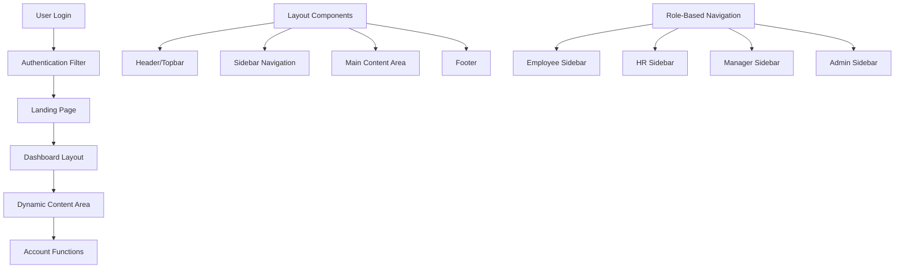

# Design Document - Dashboard Layout

## Overview

Dashboard Layout tập trung vào việc sửa chữa và cải thiện hệ thống layout hiện có trong ứng dụng HRMS. Dự án đã có sẵn các file sidebar và layout components, nhưng đang gặp lỗi và cần được đánh giá, sửa chữa để hoạt động ổn định.

Thiết kế này sẽ phân tích các vấn đề hiện tại và đưa ra phương án sửa chữa cho các components đã có, đảm bảo landing page và dashboard layout hoạt động đúng chức năng cho desktop users.

## Architecture

### High-Level Architecture



### Technology Stack

- **Backend**: Java Servlet API, JSP, JSTL
- **Frontend**: Bootstrap 5.3.3, jQuery 3.7.1, Font Awesome
- **Architecture Pattern**: MVC (Model-View-Controller)
- **Layout Pattern**: Template Method Pattern với JSP includes

## Components and Interfaces

### 1. Landing Page Enhancement

**Existing Files Analysis**:
- `src/main/webapp/view/home/home.jsp` - Cần cleanup và restructure
- `src/main/webapp/view/home/homePage_user.jsp` - Base template tốt, cần integration

**Issues to Fix**:
- Duplicate content trong home.jsp
- Inconsistent navigation links
- Missing proper session validation
- Layout structure cần standardization

**Responsibilities**:
- Sửa chữa duplicate code và broken links
- Standardize session attribute usage
- Improve navigation flow đến dashboard functions

### 2. Existing Layout Components Fix

**Current Layout Files Analysis**:
- `layout_employee.jsp`, `layout_admin.jsp`, `layout_hr.jsp`, `layout_manager.jsp` - Existing but need debugging
- `header.jsp` - Good structure, needs path fixes
- `sidebar_*.jsp` files - Role-specific sidebars exist, need integration fixes
- `topbar.jsp`, `footer.jsp` - Need consistency checks

**Identified Issues**:

#### 2.1 Asset Path Problems
**Files**: `header.jsp`, `scripts.jsp`
- **Issue**: Paths như `/assets/img/css/bootstrap.min.css` không tồn tại
- **Root Cause**: WebJars Bootstrap không được map đúng đường dẫn
- **Impact**: CSS và JavaScript không load, layout bị broken

#### 2.2 WebJars Integration Issues  
**Current Problem**: 
- Project có Bootstrap WebJars trong pom.xml nhưng paths trong JSP không match
- Cần map từ `/assets/img/css/bootstrap.min.css` sang `/webjars/bootstrap/5.3.3/css/bootstrap.min.css`

#### 2.3 Layout Structure Issues
**Files**: `layout_employee.jsp`
- **Issue**: Include paths và CSS classes không consistent
- **Missing**: Proper DOCTYPE và HTML structure
- **Problem**: Content area không render đúng

#### 2.4 Navigation URL Mapping
**Files**: `sidebar_employee.jsp`, `topbar.jsp`
- **Issue**: URLs như `/landing`, `/myContracts` cần servlet mapping
- **Missing**: Controller để handle các routes này
- **Problem**: 404 errors khi click navigation links

#### 2.5 Session Attribute Inconsistency
**Files**: Multiple layout files
- **Issue**: Inconsistent usage của `sessionScope.users` vs `users`
- **Problem**: User info không hiển thị đúng trong một số components

### 3. Simple Fix Approach

**No New Controllers Needed**: Sử dụng existing servlet structure
**No New Services**: Chỉ fix các file JSP hiện có
**No Menu Generation**: Sidebar menus đã có sẵn, chỉ cần fix paths

## Simple Fix Strategy

### 1. Asset Path Fixes
- Fix CSS/JS paths trong header.jsp và scripts.jsp
- Map WebJars paths correctly
- Ensure favicon và images load properly

### 2. Layout Integration Fixes  
- Fix JSP include paths trong layout files
- Ensure proper HTML structure
- Fix CSS class references

### 3. Navigation Link Fixes
- Update broken URLs trong sidebar files
- Ensure existing servlet mappings work
- Fix session attribute references

## Error Handling

### 1. Authentication Errors
- Redirect về login page nếu session expired
- Display error messages cho invalid access attempts
- Handle role-based access violations

### 2. Navigation Errors
- 404 handling cho invalid menu items
- Graceful degradation khi menu items không available
- Fallback content cho missing pages

### 3. Layout Rendering Errors
- Error boundaries cho component failures
- Fallback layouts khi primary layout fails
- Logging và monitoring cho layout issues

### 4. Error Display Strategy
```jsp
<!-- Error handling trong layout -->
<c:if test="${not empty errorMessage}">
    <div class="alert alert-danger alert-dismissible fade show" role="alert">
        ${errorMessage}
        <button type="button" class="btn-close" data-bs-dismiss="alert"></button>
    </div>
</c:if>
```

## Testing Strategy

### 1. Layout Fix Validation
- **JSP Include Chains**: Verify all includes work correctly
- **Asset Loading**: Test CSS/JS file loading
- **URL Mapping**: Validate all navigation links

### 2. Role-Based Testing
- **Sidebar Rendering**: Test each role's sidebar displays correctly
- **Access Control**: Verify role-based page access
- **Session Handling**: Test session attribute usage

### 3. Browser Compatibility
- **Desktop Browsers**: Test trên Chrome, Firefox, Edge
- **Layout Consistency**: Ensure consistent rendering
- **JavaScript Functionality**: Verify interactive elements work

### 4. Error Handling
- **Missing Resources**: Test graceful degradation
- **Invalid Sessions**: Test authentication redirects
- **Broken Links**: Identify và fix broken navigation

## Implementation Details

### 1. File Structure
```
src/main/webapp/view/
├── home/
│   ├── landing.jsp (new)
│   └── dashboard.jsp (enhanced)
├── common/
│   ├── dashboard_layout.jsp (new)
│   ├── dashboard_header.jsp (enhanced)
│   ├── dashboard_sidebar.jsp (new)
│   ├── dashboard_footer.jsp (enhanced)
│   └── layout_*.jsp (existing, to be integrated)
└── components/
    ├── breadcrumb.jsp (new)
    └── page_header.jsp (new)
```

### 2. CSS Organization
```
src/main/webapp/css/
├── dashboard/
│   ├── layout.css (new)
│   ├── navigation.css (new)
│   ├── responsive.css (new)
│   └── themes.css (new)
└── components/
    ├── sidebar.css (enhanced)
    └── header.css (enhanced)
```

### 3. JavaScript Modules
```
src/main/webapp/js/
├── dashboard/
│   ├── layout.js (new)
│   ├── navigation.js (new)
│   └── responsive.js (new)
└── components/
    ├── sidebar.js (enhanced)
    └── dropdown.js (enhanced)
```

### 4. Specific Fixes Needed

**Fix 1: Asset Paths trong header.jsp**
```jsp
<!-- Thay thế broken paths -->
<link href="<c:url value='/webjars/bootstrap/5.3.3/css/bootstrap.min.css'/>" rel="stylesheet" />
<!-- Thay vì -->
<link href="<c:url value='/assets/img/css/bootstrap.min.css'/>" rel="stylesheet" />
```

**Fix 2: JavaScript paths trong scripts.jsp**  
```jsp
<!-- Fix WebJars paths -->
<script src="<c:url value='/webjars/bootstrap/5.3.3/js/bootstrap.bundle.min.js'/>"></script>
<script src="<c:url value='/webjars/jquery/3.7.1/jquery.min.js'/>"></script>
```

**Fix 3: Layout structure trong layout_employee.jsp**
```jsp
<!-- Ensure proper HTML structure -->
<!DOCTYPE html>
<html lang="en">
<jsp:include page="/view/common/header.jsp" />
<body>
    <!-- Existing layout content -->
</body>
</html>
```

**Fix 4: Navigation URLs trong sidebar files**
- Check existing servlet mappings
- Update broken links to match existing controllers
- No new controllers needed

### 5. Desktop-Focused Layout Strategy

**Target Platform**: Desktop browsers only
**Screen Resolution**: Minimum 1024px width
**Browser Support**: Modern desktop browsers (Chrome, Firefox, Edge)

**Layout Adaptations**:
- Fixed sidebar width (250px)
- Full navigation menu always visible
- Standard desktop interactions
- Optimized for mouse navigation

### 6. Theme Support

**CSS Variables**:
```css
:root {
    --dashboard-primary-color: #007bff;
    --dashboard-sidebar-bg: #f8f9fa;
    --dashboard-header-height: 60px;
    --dashboard-sidebar-width: 250px;
}
```

**Theme Switching**:
```javascript
// JavaScript cho theme management
const DashboardTheme = {
    setTheme: function(themeName) {
        // Apply theme CSS variables
    },
    toggleSidebar: function() {
        // Handle sidebar collapse/expand
    }
};
```

## Security Considerations

### 1. Role-Based Access Control
- Validate user permissions trước khi render menu items
- Server-side validation cho tất cả navigation requests
- Hide sensitive functions based on user roles

### 2. Session Security
- Implement session timeout handling
- Secure session cookie configuration
- CSRF protection cho form submissions

### 3. XSS Prevention
- Escape tất cả user-generated content
- Use JSTL c:out cho output
- Validate và sanitize input parameters

### 4. Content Security Policy
```html
<meta http-equiv="Content-Security-Policy" 
      content="default-src 'self'; script-src 'self' 'unsafe-inline'; style-src 'self' 'unsafe-inline';">
```